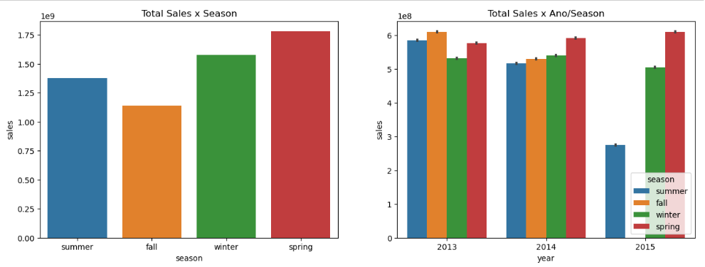
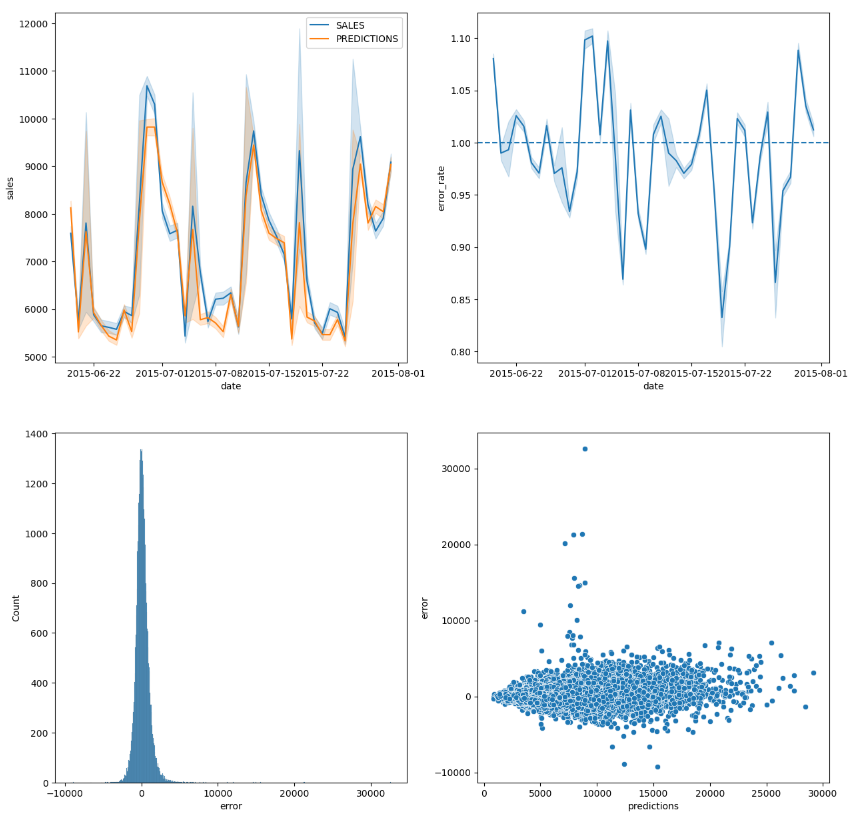

# PREVISÃO DE VENDAS ROSSMANN 

 

# PROBLEMA DE NEGÓCIO 

O CFO (Chief Financial Officer) da Rossmann pretende fazer uma reforma em todas as unidades da rede, para isso, uma parcela do faturamento das próximas 6 semanas de cada loja deverá ser destinada para essa reforma.

Assim, a fim de iniciar o processo de reformas, o CFO solicitou uma previsão de vendas de cada uma das unidades da Rossmann para as próximas 6 semanas com o objetivo de ter uma maior previsibilidade das receitas de cada loja e ser capaz alocar os recursos de forma mais eficiente

 

# PLANEJAMENTO DA SOLUÇÃO

A estratégia de solução adotada neste projeto se baseia no método CRISP-DS (*Cross Industry Standard Process for Data Science*), uma adaptação do CRISP-DM (*Cross Industry Standard Process for Data Mining*). A ideia por trás desse método é passar de forma cíclica pelas várias fases, dessa forma é possível mapear os principais problemas do projeto e entregar valor ao negócio de forma rápida. Com o fim da primeira entrega podemos fazer uma nova iteração, fazendo ajustes necessários em todas as fases.
  
Segue abaixo uma breve ilustração das principais etapas desse processo:

 

 

## _1. Business Problem_

Como citado acima, foi entendido que o problema apresentado pelo time de negócios é a dificuldade em prever o faturamento das lojas para as próximas semanas, para isso, foi solicitado um projeto para a previsão de vendas de todas as unidades da Rossmann.

 

## _2. Business Understanding_

Procurando entender a raiz deste problema, em contato com os stakeholders, foi descoberto que o que motivou a solicitação de uma previsão de vendas foi um projeto referente à reforma das unidades da Rossmann. 

Esse projeto pretende alocar uma parte do faturamento das lojas nas próximas 6 semanas para a realização dessas reformas e dada a dificuldade encontrada pelo time em prever o faturamento das lojas com mais exatidão, foi solicitado ao time de dados uma previsão de vendas.

 

## _3. Data Extraction_

Neste cenário fictício, nossa fonte de dados é um arquivo .csv de uma competição do Kaggle, mas poderia ser do banco de dados da empresa, um conjunto de planilhas dentre outras fontes. Você pode acessar a fonte dos dados [clicando aqui](https://www.kaggle.com/c/rossmann-store-sales)

 

## _4. Data Cleaning_

Após a coleta dos dados iniciou-se a etapa de limpeza dos dados. Essa etapa abrangeu alguns tópicos como:

- **_Descrição dos dados_**. Foram renomeadas as colunas, checadas os tipos das variáveis disponíveis no conjunto de dados e transformados para os tipos mais convenientes. Além de realizar o uso de estatística descritiva para obter mais informações sobre os dados a serem usados. 

- **_Tratamento dos valores nulos_**: Nesta etapa, um conjunto de premissas foi assumido para o preenchimento desses valores e podem ser conferidos em mais detalhes no notebook deste projeto.

- **_Feature Engeneering_**: Com o objetivo de facilitar a futura etapa de análise exploratória de dados, foram criadas uma série de features baseadas nas variáveis já presentes no dataset. Nessa etapa, a ideia é deixar as variáveis explicitas e de fácil acesso para as análises que serão feitas ao longo do projeto. Durante esse passo também foram criadas uma lista de hipóteses sobre o problema de negócio.

- **_Filtragem dos dados_**: Por último, foram retiradas variáveis tidas como irrelevantes para nosso projeto, como por exemplo os dias em que as lojas estavam fechadas. Além disso, foram excluídas variáveis que não estariam disponíveis no momento da predição como por exemplo o número de clientes. 

 

## _5. EDA - Exploratory Data Analysis_

Essa se trata da fase mais longa do ciclo, onde foram realizadas análises uni variadas, bivariadas e multivariada.

Durante a análise bivariada, com o objetivo de entender como as variáveis impactam o fenômeno de vendas e qual a intensidade desse impacto, foram selecionadas algumas hipóteses, da lista criada anteriormente, para serem ou não validadas.

Abaixo é exibido algumas das hipóteses e sua posterior validação ou invalidação pelos testes realizados.

**H1**. Ocorrem mais vendas no inverno.

- **FALSA:** A estação do ano que mais vende é a estação fall (outono) em 2013, e primavera(spring) nos dois anos posteriores (2014 e 2015). Lembrando que os dados de 2015 não estão completos

 

**H2**. Ocorrem menos vendas no fim de semana.

- **VERDADEIRA:** No primeiro gráfico de Total Sales x Dia da Semana vemos que temos uma tendencia de queda das vendas ao longo da semana com um novo pico no dia 5(Sexta), porém voltando a cair no dia 6 (Sábado) e tendo uma drástica queda no domingo. Porém no segundo gráfico, que se dá pela média de vendas por dia da semana, o dia 7 (domingo), possui um pico de venda. Seria necessário uma verificação mais profunda para detectar o porquê desse pico na média de vendas.

 

**H9**. Os tipos de loja influenciam na quantidade de vendas.

- **VERDADEIRO:** A loja do tipo A vende muito mais que todas as outras lojas.

 

## _6. Modeling_

Uma vez que o aprendizado dos algoritmos de machine learning é facilitado com dados numéricos que estejam na mesma escala, foram aplicadas técnicas de **Rescaling**, **Encoding** e **Transformation** a fim de preparar os dados para o treinamento do modelo de machine learning.

### _6.1. Variáveis Numéricas_
Como a maioria das variáveis numéricas do conjunto não possuem uma distribuição normal, foram aplicados métodos de Rescaling.
- Para variáveis que possuem **muitos outliers**, optamos pela utilização do **RobustScaler**, enquanto para as demais variáveis, foi utilizado o **Min-Max Scaler**.

### _6.2. Variáveis Categóricas_

Para variáveis como _season_ e _assortment_, que possuem natureza categórica, foram utilizadas as técnicas de **Label Enconding**, **One Hot Encoding** e **Ordinal Encoding**.

### _6.3. Transformação de Grandeza_

Como nossa variável reposta, vendas, não possui uma distribuição normal, a fim de facilitar a aprendizagem do algoritmo foi aplicada uma transformação do tipo logarítmica.

### _6.4. Transformação de Natureza_ 

A fim de respeitar a natureza cíclica das variáveis temporais como day, day_of_week, week_of_year, month e season foram aplicadas transformações cíclicas do tipo seno e cosseno em cada uma dessas variáveis.

### _6.5. Seleção de Features_

Nessa etapa excluímos as colunas que foram usadas para a derivação de outras variáveis e foi utilizado o algoritmo Boruta com a finalidade de identificar as features com maior relevância para o modelo. Em conjunto com as variáveis escolhidas pelo Boruta, incluímos algumas outras variáveis utilizando a experiência que ganhamos durante a fase de EDA.

Dessa forma, as variáveis usadas para treinar o modelo foram:

                         'store',
                         'promo',
                         'store_type',
                         'assortment',
                         'competition_distance',
                         'competition_open_since_month',
                         'competition_open_since_year',
                         'promo2',
                         'promo2_since_week',
                         'promo2_since_year',
                         'competition_time_month',
                         'promo_time_week',
                         'day_of_week_sin',
                         'day_of_week_cos',
                         'month_cos',
                         'month_sin',
                         'day_sin',
                         'day_cos',
                         'week_of_year_sin',
                         'week_of_year_cos'

 

## _7. Machine Learning Algorithms_

### _7.1. Modelos_

Para ter um valor como base de comparação, primeiro realizamos uma previsão através de média de vendas de cada loja, com isso poderíamos ter uma ideia se nossa solução seria melhor ou pior do que usando uma solução simples como a média.

Após isso selecionamos 4 algoritmos, sendo 2 lineares e 2 algoritmos baseados em Árvores. Os algoritmos selecionados para o teste foram:

1. Linear Regressor (sklearn)
2. Linear Regressor Regularizaded - Ridge (sklearn)
3. Random Forest Regressor (sklearn)
4. XGBoost Regressor (xgboost)

### _7.2. Time Series Cross Validation_

Após treino e avaliação de forma simples, aplicamos a técnica de cross validation, da seguinte forma:

De todo o conjunto de dados disponível, uma parcela é separada para treino e outra para validação e então a performance é avaliada. 
- Em uma segunda iteração, é utilizada outra parcela dos dados para treino e outra para validação. 
- Em uma terceira iteração, as parcelas de treino e validação são modificadas novamente e assim sucessivamente (sempre respeitando a cronologia dos dados), até que todo o conjunto de dados seja utilizado. 

Esse processo é importante para que avaliemos o modelo sobre várias perspectivas diferentes, apresentando um resultado mais fidedigno da sua real performance. Uma vez que possa existir um período nos dados onde existam características distintas.

### _7.3. Performances dos Algoritmos_

Aplicando então a técnica de Cross Validation Time Series nos algoritmos escolhidos, obtermos os seguintes resultados:
 

| Model | MAE | MAPE | RMSE
| --------- | ---------- | ----------- | -----------
Regressão Linear	| 2081.73 +/- 295.63	| 0.3 +/- 0.02	| 2952.52 +/- 468.37
Ridge	| 2081.73 +/- 295.83	| 0.3 +/- 0.02		| 2952.7 +/- 468.51
Random Forest	| 837.27 +/- 216.74	| 0.12 +/- 0.02	| 1256.61 +/- 317.76
XGBoost	|1063.51 +/- 178.21	|0.15 +/- 0.02	| 1518.89 +/- 241.61

 

Optaremos por usar o XGBoost apesar de não ter o melhor resultado. Isso se deve ao fato deste algoritmo ser mais enxuto que o Random Forest, tornando mais fácil o deploy deste modelo além de poupar espaços nos servidores, o que é um requisito importante para esse projeto.

Em um próximo ciclo do CRISP-DS podemos alterar testar novos algoritmos e verificar a performance.

### _7.4. Performances os Algoritmos_

Com o algoritmo escolhidos buscamos formas para otimizar nosso algoritmo sem que percamos muito tempo nessa etapa. A técnica escolhida foi a **Random Search** devido a sua velocidade e facilidade na implementação.

Ao fim dessa etapa temos um algoritmo otimizado e pronto para a próxima fase.

 

## _8. Evaluation_
### _8.1. Performance do Negócio_

Com o modelo otimizado, somos capazes agora de analisar a performance do modelo sobre o ponto de vista de negócio.
    
Na tabela abaixo, podemos comparar 3 cenários principais:
1. A soma real das vendas de todas as lojas durantes as 6 semanas
2. A soma das vendas previstas pelo modelo de média
3. A soma das vendas previstas pelo modelo de machine learning

| Total de Vendas | Baseline (Média) | Modelo (ML)
| --------- | ---------- | ----------- 
| R$ 289.571.750 | R$ 243.723.748 | R$ 283.633.024
    
Com essa comparação, podemos perceber que a utilização de um modelo se justifica frente a utilização da média para a projeção a receita futura uma vez que o desvio do modelo foi significativamente menor que o modelo baseline (média).

### _8.2. Possíveis Cenários_
    
Com base no erro calculado pelo modelo, podemos traçar cenários pessimistas e otimistas.

Após isso ranqueamos as lojas com base no maior MAPE (Mean Absolute Percentage Error), o erro absoluto médio em porcentagem e criamos um gráfico:

 

Como podemos ver existem 9 lojas com MAPE maior do que 20%, e 3 casos especiais com MAPE acima de 30%, o ideal seria que no próximo ciclo do CRISP-DS realizemos um estudo melhor dessas lojas, tentando colocar mais variáveis para o modelo ou fazer um modelo apenas para essas lojas e buscar o entendimento do porquê essas lojas têm maior dificuldade de previsão.

 

### _8.3. Performance do Modelo_

Uma visão geral da performance do modelo e da magnitude do seu erro intrínseco pode ser visualizada no gráfico abaixo.

- erro_rate = predictions / sales
- error = sales - predictions

 

Posteriormente poderemos realizar uma Análise dos Resíduos para que possamos melhorar ainda mais nosso modelo.

 

## _9. Deployment_

Para disponibilizar nosso produto de dados para os stakeholders, optamos por disponibilizar as predições do projeto de forma online, através do aplicativo de mensagens Telegram.

Neste aplicativo, o usuário deverá informar para um bot criado no Telegram o ID da loja a qual deseja obter a previsão de vendas nas próximas 6 semanas. Assim, o bot retornará uma mensagem com a previsão.

Para a realização dessa tarefa, foi necessário a criação duas APIs, uma para realizar carregar os dados e o modelo e realizar as previsões (handler) e outra para receber e enviar dados para o bot do telegram (rossmann_bot).

Para hostear essas aplicações, foi utilizado o [Render](https://render.com). Nessa cloud, a criação de uma conta free já permite o deploy de modelos e pequenas aplicações, sendo o suficiente para o objetivo desse projeto.

### _9.1 Bot Telegram_

Ao final de todo o processo temos o modelo em produção. Você pode acessar o bot do telegram abaixo através [deste link](https://t.me/store_predictbot)

 

 
